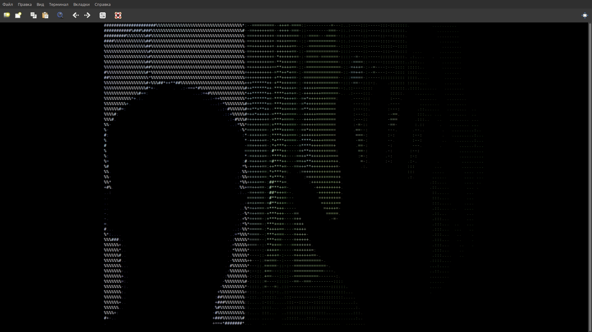

# Terminal ASCII Camera

[Russian version](README.ru.md) | English

A lightweight Python tool that renders a live camera feed as **colored ASCII art** directly inside your terminal. No GUI, no window — just characters and ANSI colors, all in a terminal emulator.

## Features

- **Colored output** — 24-bit truecolor or 256-color xterm palette.
- **Auto-fit** — adapts to your terminal window and reacts to resizing in real time.
- **Correct aspect ratio** — accounts for terminal character proportions, so the image is not stretched.
- **Selfie view** — the image is mirrored horizontally by default (like a mirror).
- **Robust cleanup** — camera is released on Ctrl+C, SIGTERM, SIGHUP.
- **No external services** — runs entirely offline on your machine.

## Requirements

- Linux (tested on Ubuntu 24.04)
- Python 3.8+
- A working webcam (/dev/video*)
- A modern terminal with truecolor support (GNOME Terminal, Konsole, Alacritty, kitty, wezterm, iTerm2, Windows Terminal)

## Installation

### 1. System packages

    sudo apt update
    sudo apt install -y python3-opencv python3-numpy

### 2. Clone the repository

    git clone https://github.com/ZeNeX1586/terminal-ascii-camera.git
    cd terminal-ascii-camera

### 3. Run

    python3 ascii_cam.py

If your camera is not on /dev/video0:

    python3 ascii_cam.py 2

## Usage

Once the script starts, the terminal switches to an alternate screen and starts rendering the camera feed as colored ASCII. Press Ctrl+C to exit — the terminal will return to its normal state.

### Freeing a busy camera

If you see "Cannot open /dev/video0", another process is using the camera. Kill it:

    sudo fuser -k /dev/video0
    python3 ascii_cam.py

## Configuration

All settings are at the top of ascii_cam.py:

| Option | Default | Description |
|---|---|---|
| CHARS | " .:-=+*#%@" | Characters from darkest to lightest. |
| CHAR_ASPECT | 2.0 | Height / width ratio of a terminal character. Tune if the image looks stretched (try 1.8 - 2.2). |
| FPS_LIMIT | 30 | Target frames per second. Lower to 15 on slow machines. |
| MIRROR | True | Flip the image horizontally (selfie view). |
| COLOR_MODE | "truecolor" | "truecolor" (24-bit) or "256" (xterm-256 palette). |

### If colors don't show up

Your terminal may not support 24-bit color. Set:

    COLOR_MODE = "256"

### If the image is stretched vertically

Your terminal font is a different shape. Tweak:

    CHAR_ASPECT = 2.2   # for a taller font
    CHAR_ASPECT = 1.8   # for a shorter font

### If the CPU is loaded

    FPS_LIMIT = 15

## How it works

1. Each frame is captured from the camera via OpenCV.
2. It is resized to the terminal grid, accounting for character aspect ratio.
3. Each cell's brightness is mapped to a character from CHARS.
4. Each cell's RGB color is wrapped in an ANSI escape sequence.
5. The whole frame is written to stdout in a single write() call with a cursor-home escape, so the terminal redraws it without flickering.

## Performance notes

On a modern CPU (Intel i5, AMD Ryzen 5), the script runs at 30 FPS at a terminal size of ~200x50 with no noticeable load. On older hardware, reduce FPS_LIMIT to 15.

## License

MIT — see LICENSE.

## Contributing

Pull requests are welcome. For major changes, please open an issue first to discuss.
